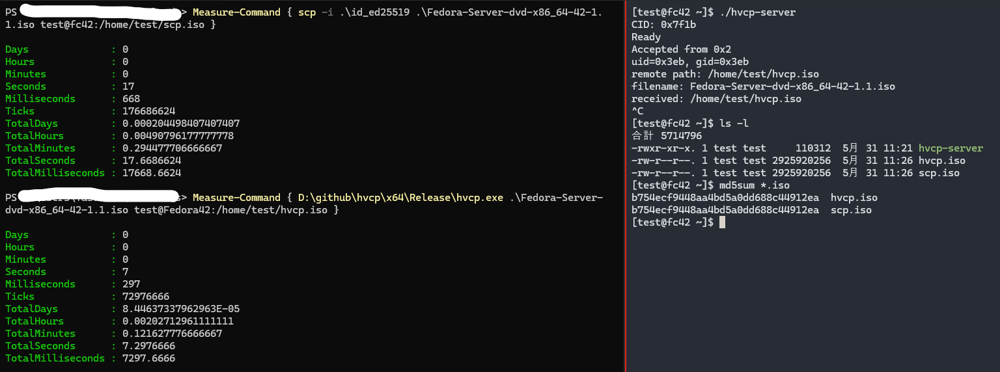

hvcp


===

Transfer files between Hyper-V host and Linux guest OSes.

You can download Windows installer from [release](https://github.com/YaSuenag/hvcp/releases) page, but need to build server daemon by yourself for Linux.

> [!IMPORTANT]
> hvcp use port `50500` with VSOCK address family on Linux. And also GUID `0000c544-facb-11e6-bd58-64006a7986d3` is used on Windows.  
> According to [Microsoft Learn](https://learn.microsoft.com/en-us/virtualization/hyper-v-on-windows/user-guide/make-integration-service), GUID for Linux guest is templated. It means port `50500` is reserved by hvcp.

hvcp gains about 2.4x performance from SCP on my PC.



Environment:

* Host
    * Hardware
        * CPU: AMD Ryzen 3 3300X
        * Memory: 16 GB
    * Windows 11 Professional (version 10.0.26100 build 26100)
    * OpenSSH\_for\_Windows\_9.5p1, LibreSSL 3.8.2
* Guest
    * Hyper-V Gen 2 guest
        * 4 vCPU
        * 8192 MB memory (enables dynamic memory)
    * Fedora 42
        * kernel-6.14.4-300.fc42.x86\_64
        * glibc-2.41-5.fc42.x86\_64
        * openssh-server-9.9p1-10.fc42.x86\_64

# How to use

## 1. Start server on Linux

```
hvcp-server
```

## 2. Copy files

You need to run `hvcp.exe` with Administrator privilege. So `sudo` or the terminal on Administrator is required.

### 2-1. Copy file to Linux guest from Hyper-V host

```
sudo hvcp path\to\file\on\host <username@>[VM Name]:/path/to/file/on/guest
```

### 2-2. Copy file to Hyper-V host from Linux guest

```
sudo hvcp [VM Name]:/path/to/file/on/guest path\to\file\on\host
```

> [!NOTE]
> The file on Linux guest should be accessed by the user who runs `hvcp-server`.  
> Basically all files can be accessed when `hvcp-server` runs via systemd because it would be run as `root`.

# Build

> [!NOTE]
> hvcp uses [simdjson](https://github.com/simdjson/simdjson). Single header code has been copied into [dll/simdjson](dll/simdjson).

## Linux

[linux](linux) is server daemon which is run on Linux guest.

```
cd linux
make
sudo make install
```

`make install` installs server daemon (`hvcp-server`) to `/usr/local/bin`, and also systemd unit file (`hvcp.service`) is copied into `/usr/lib/systemd/system`. You can enable it via `sudo systemd enable hvcp`.

## Windows

[dll](dll) is an engine of hvcp (Windows side), used by [cli](cli) which is command line tool for Windows. [installer](installer) is a project for [WiX](https://www.firegiant.com/wixtoolset/) to generate MSI package.

You can build both CLI and DLL when you build `dll` project. `installer` depends both CLI and DLL, it means all of projects would be built.

# License

Apache 2.0
